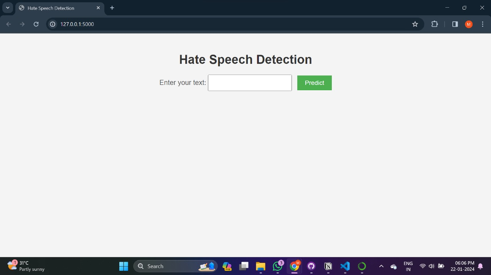

# Hate Speech Detection

## Classifies the text as hate speech or not.

## Used twitter dataset from kaggle - https://www.kaggle.com/datasets/mrmorj/hate-speech-and-offensive-language-dataset
## We have used 4 different neural network models : 
- LSTM
- RNN 
- CNN 
- ANN

## And we considered LSTM model to create a user interface by using flask to connect the model and the web page. 

### On clicking predict, the model tells if the speech is Hate Speech or not.

## The model may not give correct results, due to the lack of data. It learns only from the data which is in the dataset. For more accurate results, we will have to consider more and more data. However, computation time will be more for more data. So, it is suggested to use GPU. 

## Also, we can directly scrap data from twitter using twitter APIs.

